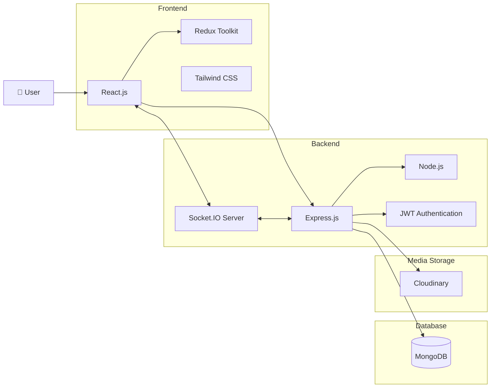

# 💬 Real-Time Chat Application


---

# 📖 About The Project
🚀 Real-Time Chat Application built with **React.js**, **Node.js**, **Express.js**, **MongoDB**, and **Socket.IO**. Features **instant messaging**, **JWT authentication**, **online user status**, and a **responsive UI** for seamless real-time communication.

---

# ✨ Key Features

* 👤 **User Authentication** – Secure signup, login, and JWT-based authentication.
* 💬 **Real-Time Messaging** – Instant message delivery powered by Socket.IO.
* 🖼️ **Image Sharing** – Send and receive images seamlessly within chats.
* 🟢 **Online User Status** – View active and online users in real time.
* 🔒 **Secure Communication** – Protected routes and authenticated user sessions.
* ⚡ **Instant Updates** – Messages and media appear instantly without page refresh.
* 👥 **Private Chats** – One-to-one conversations between registered users.
* 🗄️ **Message Storage** – Chat history and shared media securely stored in MongoDB.
* 📱 **Responsive Design** – Optimized for desktop, tablet, and mobile devices.
* 🎨 **Modern UI/UX** – Clean and intuitive interface built with React and Tailwind CSS.
* 🚀 **Fast Performance** – Optimized with React and efficient state management.
* ☁️ **Cloudinary Integration** – Secure image upload, storage, and delivery for chat media.

---

# 📸 Screenshots

## Sign Up Page


## Login Page


## Home Page


---

# 📂 Directory Structure

```text
Directory structure:
└── umesh590-realtimechatapp/
    ├── backend/
    │   ├── index.js
    │   ├── package.json
    │   ├── config/
    │   │   ├── cloudinary.js
    │   │   ├── db.js
    │   │   └── token.js
    │   ├── controllers/
    │   │   ├── auth.controllers.js
    │   │   ├── message.controllers.js
    │   │   └── user.controllers.js
    │   ├── middlewares/
    │   │   ├── isAuth.js
    │   │   └── multer.js
    │   ├── models/
    │   │   ├── conversation.model.js
    │   │   ├── message.model.js
    │   │   └── user.model.js
    │   ├── public/
    │   │   └── .gitkeep
    │   ├── routes/
    │   │   ├── auth.routes.js
    │   │   ├── message.routes.js
    │   │   └── user.routes.js
    │   └── socket/
    │       └── socket.js
    └── frontend/
        ├── README.md
        ├── eslint.config.js
        ├── index.html
        ├── package.json
        ├── postcss.config.js
        ├── tailwind.config.js
        ├── vite.config.js
        └── src/
            ├── App.jsx
            ├── index.css
            ├── main.jsx
            ├── assets/
            │   └── dp.webp
            ├── components/
            │   ├── MessageArea.jsx
            │   ├── ReceiverMessage.jsx
            │   ├── SenderMessage.jsx
            │   └── SideBar.jsx
            ├── customHooks/
            │   ├── getCurrentUser.jsx
            │   ├── getMessages.jsx
            │   └── getOtherUsers.jsx
            ├── pages/
            │   ├── Home.jsx
            │   ├── Login.jsx
            │   ├── Profile.jsx
            │   └── SignUp.jsx
            └── redux/
                ├── messageSlice.js
                ├── store.js
                └── userSlice.js

```

---
# 🏗️ Architecture

The system architecture is designed to provide **real-time communication**, **high performance**, and **scalability**. It follows a client-server architecture with separate frontend and backend responsibilities:

* **Frontend (React.js + Redux Toolkit + Tailwind CSS):** Provides user interface, manages state, and handles chat.
* **Backend (Node.js + Express.js):** Processes API requests, manages users, conversations.
* **Database (MongoDB Atlas + Mongoose):** Stores user profiles, chat messages.
* **Authentication (JWT):** Secures user access and protects private routes using token-based authentication.
* **Real-Time Communication (Socket.IO):** Enables instant messaging, live updates, and online user status tracking.
* **Media Storage (Cloudinary):** Handles image uploads and storage for chat media sharing.



---
# 🛠️ Built With

* **Frontend:** React.js, Redux Toolkit, Tailwind CSS, Axios, React Router DOM
* **Backend:** Node.js, Express.js
* **Database:** MongoDB Atlas, Mongoose
* **Authentication:** JWT, Bcrypt.js
* **Real-Time Communication:** Socket.IO
* **Cloud Storage:** Cloudinary
* **State Management:** Redux Toolkit
* **Deployment:** Render

---

# ⚙️ Getting Started

## Prerequisites

- Node.js 18+
- MongoDB Atlas
- Cloudinary Account

---

## Installation

Clone repository

```bash
git clone https://github.com/Umesh590/realtimeChatApp.git
```

Frontend

```bash
cd frontend
npm install
npm run dev
```

Backend

```bash
cd backend
npm install
npm run dev
```

---

# 🔑 Environment Variables

Create `.env` inside backend:

```env
PORT=5000
MONGO_URI=
JWT_SECRET=
EMAIL_USER=
EMAIL_PASS=
CLOUDINARY_CLOUD_NAME=
CLOUDINARY_API_KEY=
CLOUDINARY_API_SECRET=

```

---

# 🚀 Future Roadmap

* 🔔 **Push Notifications** 
* 📞 **Voice & Video Calling** 
* ✍️ **Typing Indicators** 
* 📎 **File Sharing** 
* 🌙 **Dark Mode** 
* 🤖 **AI Chat Assistant** 

---

# 👨‍💻 Developer

### Umesh Kumar

💼 MERN Stack Developer

GitHub:
https://github.com/Umesh590

LinkedIn:
https://www.linkedin.com/in/umesh-kumar111

---

# ⭐ Show Some Love

If you like this project, give it a ⭐ on GitHub.
